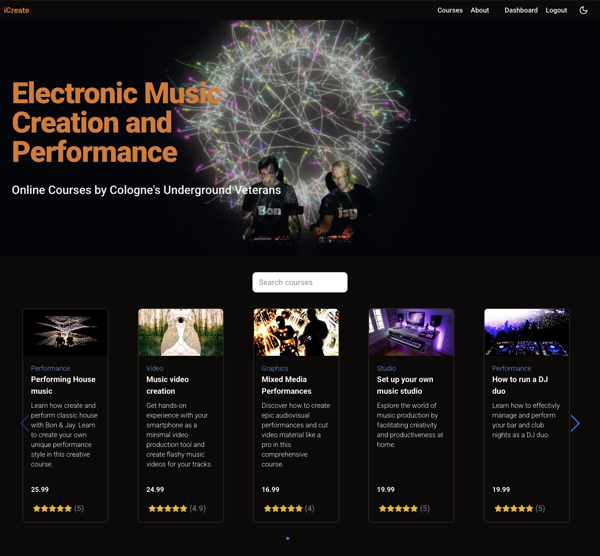
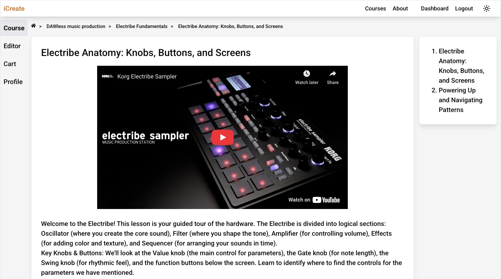
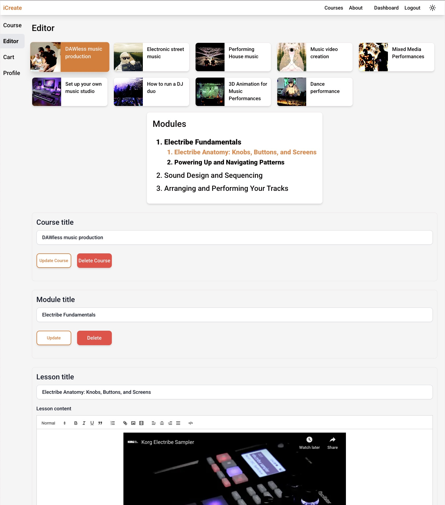

# iCreate Courses - E-Learning Full-Stack Web App

## About the project

This is my E-Learning Website portfolio project.

## Main Features

1. register / login
1. view course details, add to cart, checkout
1. view bought courses, modules, lessons
1. see learning progress
1. change profile information
1. tutors can create, updated and delete their courses, modules, lessons (using react-quill WYSIWYG editor)

## Technologies

### Front end

React.js, Typescript, Tailwind CSS, shadcn/ui react components (using Tailwind CSS & Radix UI)
vite, react router dom, axios

### Back end

MongoDB Atlas, Node.js, Express.js, Mongoose.js, bcrypt, jwt, cors, dotenv

## Theming

Theming is using shadcn/ui (index.css) and Tailwind (tailwind.config.js).

## Installation

git clone https://github.com/j-grosse/e-learning-app.git

cd e-learning-app/client  
npm i  
cp .env.example .env
cd ..  
cd server  
npm i  
cp .env.example .env

Then add your environment variables to the files /server/.env and /client/.env

## Running the app

cd e-learning-app/server  
npm run dev 

cd ../client 
npm run dev 

## Deployment
To deploy the app on https://render.com

- choose "create Web Service"

- add Render environment variables (as VITE_SERVER_BASE_URL use the final deployment url e.g. https://e-learn-68it.onrender.com)

- add Render deployment settings:  
  Branch: main  
  Root Directory: server  
  Build Command: npm i && cd ../client && npm i && npm run build  
  Start Command: npm start

